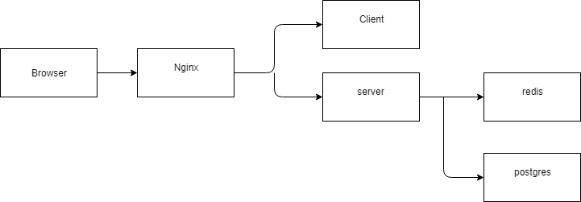

## How to start locally
The application is built using react, .net core, and postgres. To start the application locally for development you will need start each of these 3 core parts. 

1. In the core_server directory, execute `dotnet run` in a terminal. You may need to install all the despendencies, do this with the `dotnet restore` command.   
Swagger if available for this api, go to `localhost:5000/swagger` to see the ui. 

    The following environment variables are used to connect a postgres database. If not specified, the values will be set to the default. 
    Note these values are used when the application is started at runtime, not when the application is built. 

    |env       |  default |
    |----------|----------|
    |PGHOST    | localhost|
    |PGPORT    | 5432     |
    |PGUSER    | postgres |
    |PGPASSWORD| password |
    |PGDATABASE| chathub  |
    |REDIS_HOST| localhost|
    |REDIS_PORT| 6379     |

2. In the web_app directory, use the `npm start` command. Again you may need to install all the node modules, to do that do `npm install` in the same directory.   
The web app is then accessible at localhost:3000
3. You can download postgres for your os and run that server locally. 
You can also run utilizing docker with the command:   
 `docker run -p 5432:5432 -v ./data:/var/lib/postgresql/data postgres `

 To run the migrations for the database, use `dotnet ef database update`
 
 To add a migrations for the database, use `dotnet ef migrations add <name>`
 

### How to run tests:
- `npm test` to run unit test in watch mode. Note that console outputs are configured to show in the terminal.
- `npm test -- --coverage` to see the code coverage of the react unit tests 

## How to start in docker
In the same directory of the docker-compose.yaml file, do
1. `docker-compose build .` 
2. `docker-compose up`    
3. Watch the magic happen , access the application on `localhost:3000`

Below is the architecture of how the application looks when running in docker

</img>

## How to start in kubernetes
1. Setup ingress nginx, follow the steps at https://kubernetes.github.io/ingress-nginx/deploy/
2. Navigate to the kubernetes directory and do `kubectl apply -f ./`

This creates a set of kubernetes objects in our cluster including pods, clusterip, ingress, persistent volume claim, and probably more in the future. 

Currently looking into putting jenkins into a pod and configuring a pipeline
through a jenkinsfile

## Starting jenkins 
1. `docker build -t jenkins -f jenkins/Dockerfile`
2. `docker run --name -p 8080:8080 jenkins jenkins`

The first instruction contructs a image with jenkins and all the necessary tools and plugins added to it at image build time. 
The second instructions runs a container from that image and maps port 8080, the default port for jenkins

Please note that the plugins are listed in a plugins.txt folder. When editing this file on windows, make sure the line endings are converted back for linux as this could cause errors. 
If you see a lot of illegal characters and 404s and building the  jenkins image, try using `dos2unix plugins.txt` . 

